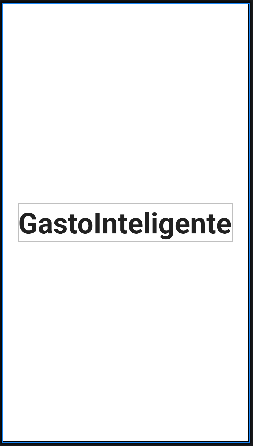
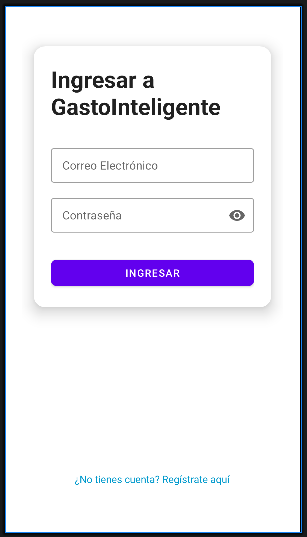
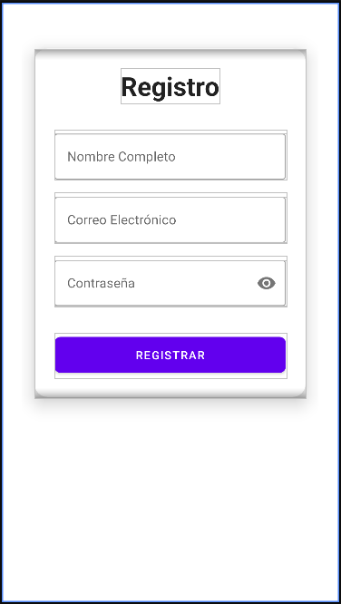

<p align="center">
  
</p>

<h1 align="center">💰 GastoInteligente</h1>

<p align="center">
  <strong>Toma el control total de tus finanzas personales con inteligencia y estilo.</strong>
</p>

<p align="center">
  
  
  
  
</p>

---

## ✨ Sobre el Proyecto

**GastoInteligente** es una aplicación móvil nativa para Android diseñada para simplificar la gestión financiera. No es solo un rastreador de gastos; es una herramienta pensada para usuarios que buscan una experiencia visualmente premium y una funcionalidad robusta.

<p align="center">
  
</p>

### 🚀 Funcionalidades Clave
- **🔐 Acceso Seguro:** Sistema de login y registro con validaciones en tiempo real.
- **🎨 UI Premium:** Implementación estricta de Material Design 3 con animaciones fluidas.
- **🌓 Modo Dinámico:** Soporte completo para temas Claro y Oscuro que se adaptan a tu sistema.
- **📱 Responsive:** Optimizado para una amplia gama de dispositivos mediante layouts inteligentes.
- **📊 Gestión Eficiente:** Interfaz limpia para la visualización de datos financieros (En desarrollo).

---

## 🛠 Stack Tecnológico

| Componente | Tecnología |
| :--- | :--- |
| **Lenguaje** | Java (JDK 17+) |
| **Diseño** | XML / Material Components |
| **Build System** | Gradle (Kotlin DSL) |
| **Arquitectura** | Patrón MVC / Clean Logic |

---

## 🏗 Estructura del Repositorio

```bash
├── app/                  # Código fuente de la aplicación Android
│   ├── src/main/java/    # Lógica de negocio y Actividades
│   └── src/main/res/     # Recursos (Layouts, Estilos, Temas)
├── docs/                 # Documentación y recursos de medios
│   └── screenshots/      # Capturas de pantalla y recursos visuales
├── CONTRIBUTING.md       # Guía para colaboradores
├── LICENSE               # Licencia MIT
└── README.md             # Esta guía principal
```

---

## 🚀 Instalación y Uso

### Requisitos Previos
- Android Studio Jellyfish (o superior)
- SDK de Android 34+
- Java 17

### Pasos para Ejecutar
1. **Clonar:**
   ```bash
   git clone https://github.com/YonierAlexisQuiceno/GastoInteligente.git
   ```
2. **Importar:** Abre Android Studio y selecciona `Open an Existing Project`.
3. **Build:** Deja que Gradle descargue las dependencias y sincronice el proyecto.
4. **Ejecutar:** Presiona `Shift + F10` o el botón de "Play" para instalar en tu emulador o dispositivo físico.

---

## 📸 Galería de Desarrollo

### Vistas de la Aplicación
A continuación se muestran las pantallas principales implementadas con Material Design 3.

<table align="center">
  <tr>
    <td align="center"><strong>Splash Screen</strong></td>
    <td align="center"><strong>Ingreso (Login)</strong></td>
  </tr>
  <tr>
    <td></td>
    <td></td>
  </tr>
  <tr>
    <td align="center"><strong>Registro</strong></td>
    <td align="center"><strong>Inicio (Home)</strong></td>
  </tr>
  <tr>
    <td></td>
    <td></td>
  </tr>
</table>

---

<p align="center">
  Desarrollado con ❤️ por <strong>Yonier Alexis Quiceno</strong>
</p>
